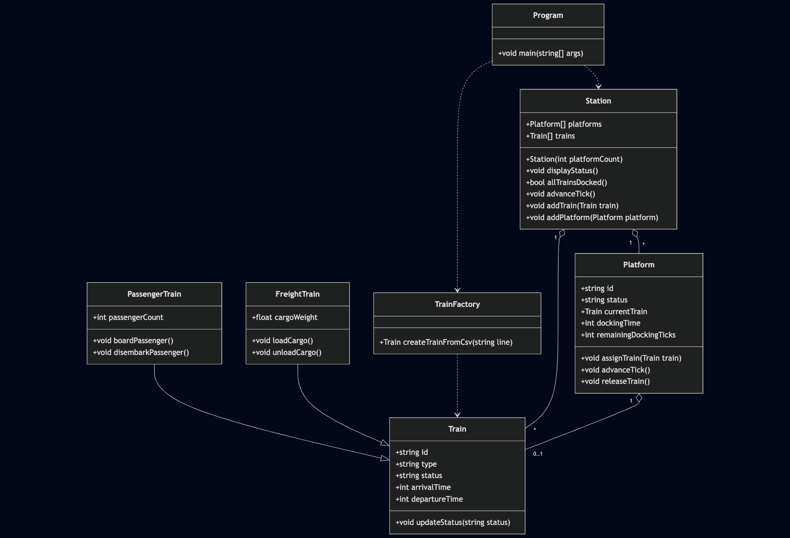

# Design Detailed Document 

## Table of Contents
1. [Introduction]
3. [Description]
3. [Problems]
4. [Conclusions]

---

## Introduction
- This is a detailed design document for the UFV Train Station Simulation. It explains what it does, the issues while building it, and the conclusions after finishing the project.
---

## Description
- The UFVTrain project is designed to simulate the management of trains, platforms, and stations. The solution is object-oriented, focusing on clear separation of responsibilities among classes. The design ensures extensibility and maintainability, allowing for future enhancements such as additional train types (csv) or station features.

## Problems 
- Managing train assignments to platforms without conflict was challenging.
- Problems whe using the stream writer / reader, waste a lot of time int this part.
---

## Conclusions

- This project helped deepen my understanding of class relationships and design patterns. For future projects, starting with a clear straight forward plan is essential.
